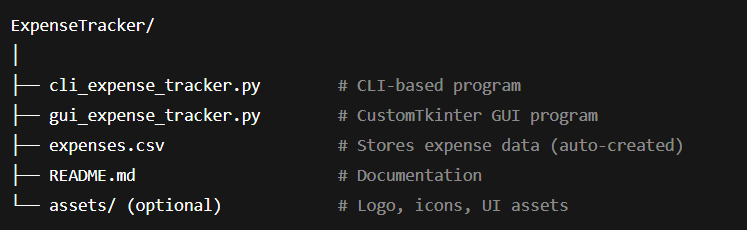
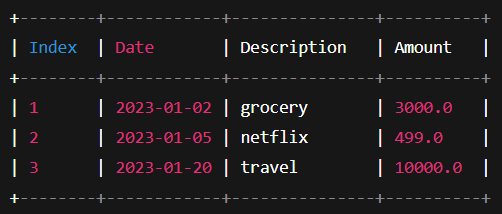

# 💰 Expense Tracker – CLI & GUI Application

Welcome to the Expense Tracker, a simple and efficient Python-based application to manage daily expenses.
This project includes two ways to use the application:

1️⃣ CLI Version – Run through terminal<\n>
2️⃣ GUI Version (CustomTkinter) – Modern and user-friendly UI

---

## 🧩 Features

✅ CLI Version

Add new expenses (date, description, amount)
View all saved expenses in tabular format
Automatically stores data in a CSV file (expenses.csv)
Lightweight and fast

✅ GUI Version

Clean and modern UI using CustomTkinter
Form-based expense entry
Display feedback messages on UI
Auto-save to expenses.csv
Navigation through different sections (Add, View, etc.)  

---

## 📂 Project Structure



---

## ⚙️ Technologies Used

- 🐍 **Python 3**
- 📊 **Tabulate Library** (for clean tabular display)
- 🧱 **CSV File Handling**
- 🧩 **OS Module** (for file management and checks)

---

## 🧠 Concepts Covered

- File handling (`read`, `write`, `append`, `delete`)
- Data parsing and reindexing
- List and string manipulation
- CLI-based user interaction
- Basic data organization and filtering

---

## 🚀 How to Run

1. Clone this repository  
   ```bash
   git clone https://github.com/BirajDas27/Basic-Expense-Tracker.git
   cd expense-tracker

---

## 🧮 Run the program

python expense_tracker.py

---

## 📚 Packages

Tabulate package - pip install tabulate

---

## 🎯 Some important features

* Add new expenses
* View all records
* Search or delete entries
* Check monthly totals

---

🌟 Example Output



---

🎯 Future Enhancements

* 📊 Add category-wise expense charts
* 💡 Introduce budget alerts and savings goals
* 🪟 GUI version using Tkinter / PyQt
* 📈 Generate monthly reports in Excel or PDF
* ☁️ Cloud sync or database integration

---

💬 About the Project

This project demonstrates:
* Practical usage of Python fundamentals
* Real-world file I/O operations
* Designing modular and reusable code
* A foundation for finance management apps
